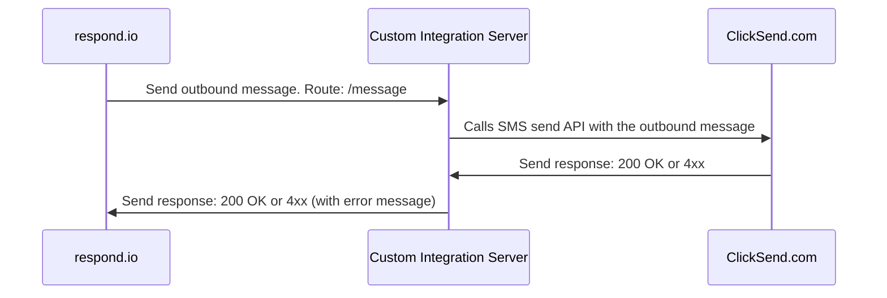
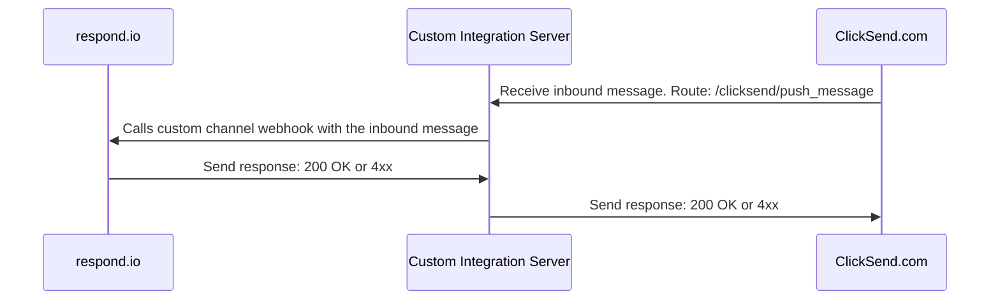

# Custom Channel Integration Server (Example)

⚠️ **Important Notice**  
👉 **We do not provide support via GitHub Issues.** If you encounter a problem or need help, please reach out to our [Support team](https://respond.io/contact) directly. Thank you for your understanding!

This is a sample project to help you get started with integrating the [respond.io](https://respond.io) platform with any third-party messaging service provider, as a "custom channel" within respond.io.

This example implements an SMS provider called [ClickSend.com](https://clicksend.com). The code can be used as a general reference.

## API Routes

| Method | Path | Type | Description |
| ---- | ------ | --- | ------------------ |
| POST| /message | Outbound | Receive messages from respond.io and pass them to ClickSend using API |
| POST| /clicksend/push_message | Inbound | Receive messages from ClickSend and pass them to respond.io via the custom channel webhook |

>**Port**: 3030.

Follow the steps [here](https://docs.respond.io/messaging-channels/custom-channel#step-1-create-a-channel) to get the custom channel API token.

## Setup

Run the following commands:

- `npm install`
- `npm start`

## How it works?

### Outbound Messages

### Inbound Messages

[See the visual diagram on Whimsical](https://whimsical.com/diagram-4eQ4FGca7go5gZ7vMEJfwU)

## References

- [ClickSend.com API Docs](https://developers.clicksend.com/docs/rest/v3/#view-inbound-sms)
- [respond.io: Custom Channel](https://docs.respond.io/messaging-channels/custom-channel)

