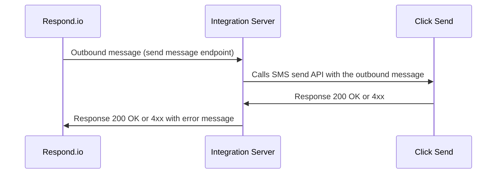
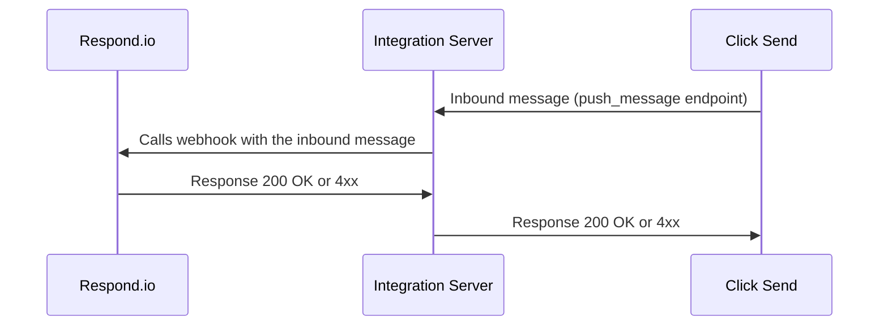

# Custom Channel Integration Example

In this example we will be integrating the respond.io platform with the third party platform to use them as a channel inside respond.io.

In this example we will be using the [ClickSend](https://clicksend.com) SMS provider as a reference

## Endpoints

| Method | Path | Description |
| ---- | ------ | ------------------ |
| POST| /message | Handle outbound messages i.e. receive messages from the respond.io and pass them to the clicksend using API |
| POST| /clicksend/push_message | Handle inbound messages i .e receive messages from the clicksend and pass them to the respond.io using webhook |

## Sequence Diagrams
We will be explaining the outbound and inbound message handling with the help of sequence diagrams
### Outbound Message

### Inbound Message

